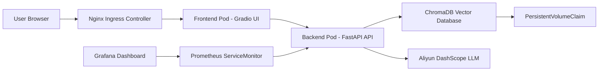
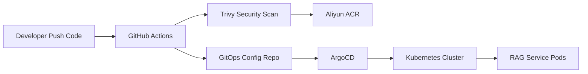

# RAG-Cloud-Native-Practice (大模型 RAG 云原生高阶架构实践)


## 项目简介 (Overview)

本项目是一个面向生产级交付标准的大模型 RAG（Retrieval-Augmented Generation，检索增强生成）云原生工程化实践项目。

项目从一个本地运行的 RAG 脚本起步，逐步完成容器化、微服务拆分、CI/CD 自动化、GitOps 持续交付、Ingress 七层流量治理、Prometheus + Grafana 可观测性建设，以及 ChromaDB 向量数据库持久化改造，最终构建出一个基于 Kubernetes 的企业级 AI 应用交付体系。

> 核心设计理念：跨越 AI Demo 与生产级 AI 应用之间的工程鸿沟，重点解决 AI 应用在云原生环境中的交付、伸缩、观测、持久化和自动化运维问题。

---

## 系统拓扑架构 (Architecture Topology)

本项目在 Kubernetes 中实现了计算与存储分离、前后端解耦、七层流量接入以及全链路可观测。



---

## 云原生交付链路 (Cloud Native Delivery Workflow)

项目采用双仓 GitOps 架构，将业务代码仓与 Kubernetes 配置仓彻底解耦。



交付流程如下：

1. 开发者向业务代码仓库 Push 代码。
2. GitHub Actions 自动触发 CI 流水线。
3. CI 执行 Docker 镜像构建。
4. Trivy 对镜像进行安全扫描，实现安全左移。
5. 扫描通过后，将镜像推送至阿里云 ACR。
6. CI 自动修改 GitOps 配置仓库中的镜像 Tag。
7. ArgoCD 监听 GitOps 仓库变更。
8. ArgoCD 将期望状态同步到 Kubernetes 集群。
9. Kubernetes 执行滚动更新，完成服务发布。

---

## 核心工程化演进 (Key Engineering Highlights)

本项目经历了三次重大架构演进，实现了从本地 AI Demo 到云原生 AI 应用的完整升级。

### V1.0: 基础设施即代码 (IaC) 与 CI/CD 飞轮

- **Terraform 自动化编排**：抛弃手工点击控制台，使用 main.tf 声明式管理底层云资源。
- **Docker 容器化改造**：将本地 RAG 应用封装为标准容器镜像，实现环境一致性和可移植交付。
- **GitHub Actions 自动化流水线**：代码 Push 后自动完成构建、扫描、推送和配置更新。
- **Trivy 安全左移扫描**：在镜像推送前执行漏洞扫描，对 CRITICAL 和 HIGH 级别漏洞进行阻断。
- **双仓 GitOps 模式**：业务代码仓与 Kubernetes Manifests 配置仓分离，职责边界清晰。
- **ArgoCD Pull-based Delivery**：通过 ArgoCD 拉取 GitOps 仓库状态并同步到集群，避免 CI 系统直接持有集群高权限凭证。

### V2.0: 微服务拆分与全链路可观测性 (Observability)

- **前后端解耦**：将单体 app.py 拆分为前端 ui.py 与后端 api.py。
- **FastAPI 后端算力层**：后端服务专注于 RAG 检索、向量查询和大模型调用。
- **Gradio 前端展示层**：前端服务专注于用户交互和问答展示。
- **独立横向扩缩容**：前后端可根据访问压力和算力压力分别扩容。
- **Nginx Ingress 七层路由**：通过 Ingress 统一接管外部访问入口，替代简单 NodePort 暴露方式。
- **Prometheus + Grafana 可观测体系**：通过业务指标埋点和 ServiceMonitor 实现接口 QPS、请求延迟、错误率等指标采集。
- **SRE 监控闭环**：通过 Grafana Dashboard 实现服务运行状态可视化，为后续容量规划和故障排查打基础。

### V3.0: 状态剥离与持久化大脑 (Stateful Persistence)

- **计算与存储分离**：将向量索引从本地文件系统剥离，迁移到 ChromaDB 向量数据库。
- **ChromaDB 向量数据库**：用于存储 RAG 知识库 Embedding 数据，支撑语义检索能力。
- **StatefulSet 部署有状态服务**：使用 Kubernetes StatefulSet 管理 ChromaDB，保证服务身份稳定。
- **PVC 持久化存储**：通过 PersistentVolumeClaim 挂载持久化存储，避免 Pod 重建导致知识库数据丢失。
- **知识库快速恢复**：服务重启后可直接加载已有向量数据，减少重复 Embedding 成本。

---

## 技术栈 (Tech Stack)

### AI 应用层
- Python 3.11, LlamaIndex, FastAPI, Gradio, DashScope API
### 容器化与编排
- Docker, Docker Compose, Kubernetes, Kustomize, Nginx Ingress Controller
### 有状态存储
- ChromaDB, StatefulSet, PersistentVolumeClaim
### CI/CD 与 GitOps
- GitHub Actions, 阿里云 ACR, ArgoCD, GitOps 双仓模式
### 可观测性与 SRE
- Prometheus, Grafana, kube-prometheus-stack, ServiceMonitor
### 基础设施即代码
- Terraform, HCL

---

## 快速开始 (Quick Start)

本项目提供本地容器化快速联调与 Kubernetes 集群原生部署两种运行方式。
请确保在运行前已获取大模型 API 凭证（以阿里云 DashScope 为例）。

### 方式一：本地 Docker Compose 运行 (推荐开发调试)
无需 K8s 集群，在本地即可一键拉起前后端双微服务与 ChromaDB 数据库。

1. 克隆业务源码仓库：
```bash
git clone https://github.com/AmazingYe-oss/edu-rag-bot.git
cd edu-rag-bot
```

2. 注入大模型 API 凭证并启动：
```bash
export DASHSCOPE_API_KEY="sk-your-api-key-here"
docker-compose up -d --build
```

3. 访问浏览器体验：
- 前端交互界面 (UI): `http://localhost:7860`
- 后端接口文档 (API): `http://localhost:8000/docs`

### 方式二：Kubernetes 原生部署 (推荐生产验证)

配合 GitOps 配置仓库，在 K8s 集群中实现包含网关、探针、持久化存储及监控在内的完整云原生部署。

#### 步骤 0：集群基础环境预置（必做项）
> **避坑提示**：如果是全新安装的 K8s（或重置了 Docker Desktop），**必须**先安装基础组件，否则会导致后续部署报错或持续卡在 `Progressing` 状态。

1. **安装 NGINX Ingress 网关**（用于接收外部网页请求）：
```bash
kubectl apply -f https://raw.githubusercontent.com/kubernetes/ingress-nginx/controller-v1.10.1/deploy/static/provider/cloud/deploy.yaml
```

2. **安装 Prometheus Operator**（提供 ServiceMonitor 等监控 CRD 资源）：
```bash
helm repo add prometheus-community https://prometheus-community.github.io/helm-charts
helm repo update
helm install prometheus-operator prometheus-community/kube-prometheus-stack -n edu-rag-bot --create-namespace
```

#### 步骤 1：注入机密凭证 (Secret)
由于安全原因，API Key 不应硬编码在 Git 仓库中。请**先创建命名空间**，并手动注入大模型 API 密钥（注意：**Secret 命名必须严格为 `edu-rag-bot-secret`**，否则后端容器将因读取不到配置而无法启动）：
```bash
kubectl create namespace edu-rag-bot
kubectl create secret generic edu-rag-bot-secret \
  --from-literal=DASHSCOPE_API_KEY="sk-这里填你真实的Key" \
  -n edu-rag-bot
```

#### 步骤 2：一键应用资源清单
你可以选择以下两种方式之一部署核心业务代码：

*   **选项 A：使用 Kustomize 声明式部署（常规方式）**
```bash
kubectl apply -k https://github.com/AmazingYe-oss/edu-rag-bot-gitops.git/apps/edu-rag-bot
```

*   **选项 B：接入 ArgoCD GitOps 纳管（进阶推荐）**
若集群已安装 ArgoCD，可直接应用 Application 资源，开启自动化同步流水线：
```bash
kubectl apply -f https://raw.githubusercontent.com/AmazingYe-oss/edu-rag-bot-gitops/main/edu-rag-bot-application.yaml
```

#### 步骤 3：验证与访问
部署完成后，观察所有 Pod 是否进入 `Running` 状态：
```bash
kubectl get pods -n edu-rag-bot -w
```

待全部就绪后，系统提供了**两种**访问方式供本地测试使用：

**访问方式一：通过 Ingress 本地虚拟域名访问（推荐，最贴近生产）**
本项目 Ingress 配置的路由规则为 `rag.weiye.local`。需要在本机配置 hosts 域名劫持：
1. 以管理员身份打开文件（Windows: `C:\Windows\System32\drivers\etc\hosts`，Mac/Linux: `/etc/hosts`）。
2. 在文件末尾添加以下映射并保存：
   `127.0.0.1 rag.weiye.local`
3. 打开浏览器，直接访问：http://rag.weiye.local

**访问方式二：物理端口转发访问（备用方案）**
若 Ingress 暂未生效，或不想修改系统 hosts 文件，可使用原生端口转发直连前端容器：
1. 在终端执行以下命令（保持窗口开启不要关闭）：
```bash
kubectl port-forward deployment/rag-frontend 7860:7860 -n edu-rag-bot
```
2. 打开浏览器访问：http://localhost:7860

---

#### 常见故障排查 (Troubleshooting)

*   **Q: 后端 Pod 状态为 `CreateContainerConfigError`？**
    *   **A**: 通常是因为忘记执行【步骤 1】注入 API Key，或者 Secret 命名不是 `edu-rag-bot-secret`。可通过 `kubectl describe pod <pod-name> -n edu-rag-bot` 查看底部 Events 确认。

*   **Q: 后端 Pod 报错 `KeyError: 'dimension'` 或 404 无法连接 ChromaDB？**
    *   **A**: 典型的微服务版本漂移问题。请确保后端的 `chromadb` 依赖版本与 K8s 中部署的 ChromaDB 镜像版本一致（本项目要求统一为 **`0.5.3`**）。

*   **Q: 部署时提示 `no matches for kind "ServiceMonitor"`？**
    *   **A**: 集群中缺失 Prometheus 的 CRD 资源。请退回执行【步骤 0】安装 kube-prometheus-stack。

*   **Q: ArgoCD 界面中 Ingress 资源一直处于黄色 `Progressing` 状态？**
    *   **A**: 集群未安装 Ingress Controller，导致流量图纸无法被解析分发。执行【步骤 0】安装 NGINX Ingress 即可修复。

---

## 核心代码目录结构 (Repository Structure)

```text
├── .github/workflows/       # GitHub Actions CI 自动化流水线
├── data/                    # RAG 知识库初始文档
├── src/                     # RAG 核心逻辑实现
├── api.py                   # FastAPI 后端微服务算力层
├── ui.py                    # Gradio 前端展示层
├── Dockerfile               # 微服务统一镜像构建文件
├── docker-compose.yml       # 本地快速联调编排文件
├── requirements.txt         # Python 核心依赖
└── main.tf                  # Terraform IaC 基础设施代码
```
> 注：Kubernetes 集群的 GitOps 声明式配置（Deployment、Ingress、StatefulSet、ServiceMonitor 等）维护在独立的 GitOps 配置仓库中。

---

## 项目亮点 (Project Highlights)

- 从本地 RAG 脚本演进为 Kubernetes 上的云原生 AI 应用。
- 使用 GitHub Actions、阿里云 ACR、ArgoCD 打通端到端自动化发布链路。
- 引入 Trivy 安全扫描，在 CI 阶段实现容器镜像安全左移。
- 使用双仓 GitOps 模式，实现业务代码与基础设施配置解耦。
- 通过 Nginx Ingress 实现七层流量入口治理。
- 通过 Prometheus + Grafana 构建基础 SRE 可观测能力。
- 通过 ChromaDB + StatefulSet + PVC 实现知识库向量数据持久化。
- 覆盖 AI 工程化、DevOps、SRE、Kubernetes、GitOps、IaC 等多个生产级技术域。

---

## 适用场景 (Use Cases)

本项目适用于以下场景：
- 企业内部知识库问答系统
- 云原生 AI 应用工程化实践
- Kubernetes 上的 RAG 服务部署
- AI 应用 CI/CD 与 GitOps 交付演示
- 云计算、DevOps、SRE、解决方案架构师岗位作品集项目

---

## 作者 (Author)

**朱玮烨 (AmazingYe)**
- 2027届 数据科学与大数据技术
- AWS Certified Solutions Architect - Professional
- 阿里云大模型 ACP 认证
- 寻求云计算 / 云原生 / DevOps / SRE / AI 工程化相关实习机会，欢迎联系交流！
