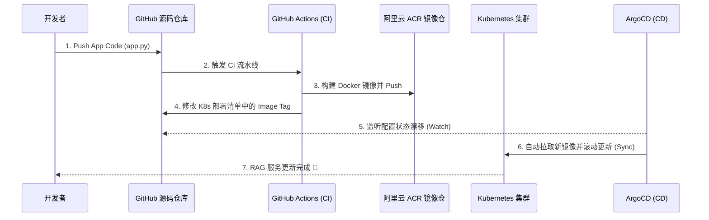

# RAG-Cloud-Native-Practice (大模型 RAG 云原生工程化实践)


##项目简介 (Overview)

本项目是一个面向云原生交付架构的工程化实践项目。
项目将基于本地运行的**大语言模型 RAG（检索增强生成）问答应用**，进行完整的微服务重构、容器化封装，并最终通过 **Terraform、GitHub Actions 与 ArgoCD** 实现基础设施即代码 (IaC) 与纯正的 **GitOps (拉模式) 自动化部署链路**。

> **核心设计理念**：不局限于 AI 算法本身的开发，而是聚焦于 AI 应用从“本地脚本”到“生产级云原生应用”的完整工程化交付闭环。

---

## 架构设计与 GitOps 工作流 (Architecture & Workflow)

本项目严格遵循 GitOps 最佳实践，实现了从代码提交到集群状态同步的全自动化闭环。



---

## 技术栈 (Tech Stack)

*   **AI 与后端应用**：`Python 3.11`, `Gradio`, `DashScope API` (阿里云百炼)
*   **基础设施编排 (IaC)**：`Terraform (HCL)` (自动化编排底层资源)
*   **容器化与编排**：`Docker`, `Kubernetes (K8s)`
*   **持续交付 (CI/CD)**：`GitHub Actions` (自动化 CI 构建), `阿里云 ACR` (镜像托管), `ArgoCD` (GitOps 交付)

---

## 核心目录结构 (Repository Structure)

```text
├── .github/workflows/       # GitHub Actions CI 流水线定义
│   └── main.yml             # 包含 docker build, push ACR, 及自动更新 Tag 逻辑
├── data/                    # RAG 知识库基础文档
├── src/                     # RAG 核心逻辑 (加载、索引、检索)
├── app.py / main.py         # Gradio/FastAPI Web 服务入口
├── Dockerfile               # 深度优化的容器构建文件
├── docker-compose.yml       # 本地快速开发与调试配置
├── main.tf                  # Terraform IaC 基础设施声明代码
├── requirements.txt         # Python 依赖清单
└── k8s/                     # (GitOps) Kubernetes 声明式部署清单 (Deployment, Service, Secret 等)
```

---

## 核心工程化亮点 (Key Features)

1. **容器化极致优化**：编写深度优化的 `Dockerfile`，使用 `python-slim` 基础镜像，结合 `.dockerignore` 缓存机制，规避冗余构建阻塞，压缩镜像体积。
2. **IaC 基础设施即代码**：抛弃手工点击控制台，使用 `main.tf` (Terraform) 声明式管理底层资源。
3. **安全与凭证管理**：大模型 API Key 拒绝明文硬编码，通过 K8s `Secret` 结合 `envFrom.secretRef` 安全注入 Pod 环境变量。
4. **真正的 GitOps 闭环**：通过 GitHub Actions 完成镜像构建后，自动回写更新 Git 仓库中的 Image Tag。ArgoCD 察觉状态漂移后，自动向 K8s 集群发起 Sync 更新，彻底消除 `kubectl apply` 手工操作。

---

## 快速开始 (Quick Start)

### 1. 本地 Docker 运行
请确保已配置大模型 API Key，在项目根目录执行：
```bash
# 注入环境变量并启动容器
export DASHSCOPE_API_KEY="your_api_key_here"
docker-compose up -d --build
```
访问 `http://localhost:7860` 即可体验 RAG 问答界面。

### 2. Terraform 基础设施构建
```bash
# 初始化并应用基础设施配置
terraform init
terraform plan
terraform apply -auto-approve
```

### 3. K8s / ArgoCD 部署
```bash
# 假设 ArgoCD 已在集群中就绪，应用 GitOps 配置
kubectl apply -f edu-rag-bot-application.yaml
```

---

## 作者 (Author)

**朱玮烨 (AmazingYe)**
*   2027届 数据科学与大数据技术
*   AWS Certified Solutions Architect - Professional
*   阿里云大模型 ACP 认证
*   寻求 **云计算 / 云原生 / DevOps / AI工程化** 相关实习机会，欢迎联系交流！
