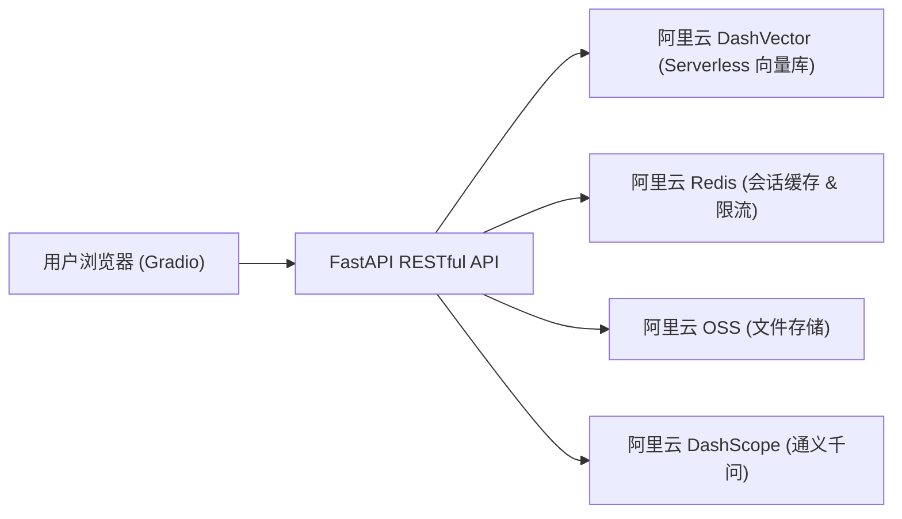
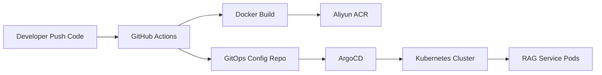

# Edu RAG Bot — 教育知识库智能问答系统


## 项目简介

本项目是一个面向教育场景的 **RAG（检索增强生成） 智能问答系统**，服务于企业内部新员工培训与知识管理。

系统基于 **LlamaIndex + 通义千问（DashScope）** 构建 RAG 检索链路，使用**阿里云 DashVector** 作为 Serverless 向量数据库，**阿里云 Redis** 提供会话记忆与 API 限流，**阿里云 OSS** 实现文档云端存储，前端采用 **Gradio** 交互式界面，后端采用 **FastAPI** 微服务架构，支持 **SSE 流式打字机输出**，并通过 **Docker + Kubernetes + GitHub Actions + GitOps** 实现云原生交付。

**V6.0 RAG 2.0 核心升级**：引入多租户隔离架构，支持用户级文件物理隔离、全局摘要生成、智能切片与 Metadata 标签绑定，以及基于 `user_id` 的向量库检索过滤，确保数据安全与高精度检索。

> 核心定位：将企业内部的制度文档、开发规范、课程资料等非结构化知识，转化为可即时检索、智能问答的 AI 知识库助手。

---

## 系统架构



### 核心数据流

1. 用户在 Gradio 前端输入问题
2. FastAPI RESTful 后端接收请求，先查询 **Redis 缓存**（命中则直接返回，零 LLM 调用费用）
3. 未命中缓存时，从 **Redis** 提取该会话的短期历史记忆，拼接上下文
4. 调用 **DashVector** 进行向量语义检索，获取相关知识片段
5. 将检索上下文 + 历史记忆组装 Prompt，调用 **DashScope 通义千问** 大模型
6. 通过 **SSE (Server-Sent Events)** 流式返回打字机效果
7. 回答完成后写入 Redis 缓存（TTL 1小时）并保存会话记忆（TTL 24小时）

### RESTful API 架构

系统采用 RESTful API 设计，路由模块化：
- `src/routers/conversations.py` — 会话管理与消息流
- `src/routers/search.py` — 纯检索接口
- `src/routers/documents.py` — 文档上传与 OSS 存储
- `src/schemas/` — Pydantic 请求/响应模型

---

## 核心特性

### RAG 检索引擎
- **LlamaIndex** 编排框架：文档加载 → 向量化 → 索引构建 → 语义检索 → Prompt 组装 → 大模型调用
- **DashScope Embedding**（text-embedding-v3）：将文档切片转化为 1536 维向量
- **DashScope LLM**（qwen-plus）：基于检索上下文生成精准回答
- 支持多种文档格式：TXT、Markdown、PDF、DOCX、Jupyter Notebook
- **RESTful API**：模块化路由设计，支持会话管理、文档上传、纯检索等接口

### SSE 流式输出
- 基于 `stream_chat` 实现逐字打字机效果，用户体验更佳
- 前端通过 SSE 实时渲染，同时展示检索溯源上下文

### 会话记忆管理
- **Redis List** 存储短期对话历史（每个 session 独立，默认保留最近 3 轮）
- 自动拼接历史上下文，实现多轮连贯对话
- 会话数据 24 小时自动过期清理

### 智能缓存与限流
- **Redis 语义缓存**：相同问题精确匹配缓存，1 小时内重复查询零 LLM 调用成本
- **API 限流保护**：基于 Redis + FastAPI-Limiter，单接口每分钟最多 5 次请求

### 文件上传 (OSS) - RAG 2.0
- **多租户物理隔离**：文件路径动态拼接为 `users/{user_id}/documents/{date}/{filename}`
- **全局摘要生成**：异步调用大模型提取文档前 3000 字符，生成 100 字以内的类别/主题摘要
- **智能切片与 Metadata 绑定**：RecursiveCharacterTextSplitter 切片后自动绑定 `user_id`、`filename`、`upload_time`、`summary`
- **向量库隔离入库**：带标签的 Documents 批量存入 DashVector，支持后续精准过滤
- 支持服务端上传与预签名 URL 直传两种模式

### 可观测性
- 集成 **prometheus-fastapi-instrumentator**，自动暴露 `/metrics` 端点
- 支持 QPS、请求延迟、错误率等接口指标采集

### 多租户检索隔离 (RAG 2.0)
- **MetadataFilters 精准过滤**：检索时根据 `user_id` 在 DashVector 层执行 ExactMatch 过滤
- **端到端身份透传**：从 API 请求到向量库查询全程携带 `user_id`，杜绝跨租户数据泄露
- **零费用纯检索接口**：`/api/v1/search` 支持传入 `user_id`，仅返回匹配片段，不调用 LLM

---

## 技术栈

| 层级 | 技术选型 |
|------|---------|
| AI 框架 | LlamaIndex, DashScope API (通义千问 + text-embedding-v3) |
| 后端 | FastAPI, Uvicorn, SSE Streaming |
| 前端 | Gradio (Soft 主题，自适应暗色/亮色) |
| 向量数据库 | 阿里云 DashVector (Serverless) |
| 缓存 & 限流 | 阿里云 Redis, FastAPI-Limiter |
| 对象存储 | 阿里云 OSS (oss2 SDK) |
| 容器化 | Docker (多阶段构建), Docker Compose |
| 编排 & 部署 | Kubernetes, Terraform (IaC), Nginx Ingress |
| CI/CD | GitHub Actions → 阿里云 ACR → GitOps 双仓模式 |
| 可观测性 | Prometheus (fastapi-instrumentator) |

---

## 快速开始

### 前置条件

- Python 3.10+
- 阿里云 DashScope API Key（[申请地址](https://dashscope.console.aliyun.com/)）
- 阿里云 DashVector 实例（[开通地址](https://dashvector.console.aliyun.com/)）
- 阿里云 Redis 实例（可选，本地可用 Redis 替代）
- 阿里云 OSS Bucket（可选，不配置则文件上传功能不可用）

### 方式一：本地运行（开发调试）

1. 克隆仓库：
```bash
git clone https://github.com/AmazingYe-oss/edu-rag-bot.git
cd edu-rag-bot
```

2. 安装依赖：
```bash
pip install -r requirements.txt
```

3. 配置环境变量（复制模板并填入真实密钥）：
```bash
cp .env.example .env
# 编辑 .env 文件，填入以下必填项：
# - DASHSCOPE_API_KEY      (必填，大模型调用)
# - DASHVECTOR_API_KEY     (必填，向量数据库)
# - DASHVECTOR_ENDPOINT    (必填，向量数据库)
# - REDIS_HOST / PASSWORD  (推荐，会话缓存)
# - OSS_ACCESS_KEY_ID 等   (可选，文件上传)
```

4. 启动后端与前端：
```bash
# 终端 1：启动后端 API
python api.py

# 终端 2：启动前端 UI
python ui.py
```

5. 访问：
- 前端界面：`http://localhost:7860`
- 后端 API 文档：`http://localhost:8000/docs`

### 方式二：Docker Compose 一键启动

```bash
# 确保 .env 文件已配置好
docker-compose up -d --build
```

访问地址同上：
- 前端：`http://localhost:7860`
- 后端：`http://localhost:8000/docs`

### 方式三：Kubernetes 云原生部署

#### 步骤 0：集群基础环境预置

> 全新集群必须先安装以下组件：

1. **安装 NGINX Ingress Controller**：
```bash
kubectl apply -f https://raw.githubusercontent.com/kubernetes/ingress-nginx/controller-v1.10.1/deploy/static/provider/cloud/deploy.yaml
```

2. **安装 Prometheus Operator**（用于 ServiceMonitor 监控 CRD）：
```bash
helm repo add prometheus-community https://prometheus-community.github.io/helm-charts
helm repo update
helm install prometheus-operator prometheus-community/kube-prometheus-stack -n edu-rag-bot --create-namespace
```

#### 步骤 1：注入机密凭证

```bash
kubectl create namespace edu-rag-bot
kubectl create secret generic edu-rag-bot-secret \
  --namespace edu-rag-bot \
  --from-literal=DASHSCOPE_API_KEY="你的通义千问Key" \
  --from-literal=OSS_ACCESS_KEY_ID="你的OSS子账号AK" \
  --from-literal=OSS_ACCESS_KEY_SECRET="你的OSS子账号SK" \
  --from-literal=OSS_ENDPOINT="oss-cn-shanghai.aliyuncs.com" \
  --from-literal=OSS_BUCKET_NAME="你的真实桶名" \
  --from-literal=REDIS_HOST="你的阿里云Redis地址" \
  --from-literal=REDIS_PASSWORD="你的Redis密码" \
  --from-literal=DASHVECTOR_API_KEY="你的DashVector密钥" \
  --from-literal=DASHVECTOR_ENDPOINT="你的DashVector地址"

```

> Secret 命名必须为 `edu-rag-bot-secret`，否则后端无法读取配置。

#### 步骤 2：部署应用

**选项 A：Kustomize 部署**
```bash
kubectl apply -k https://github.com/AmazingYe-oss/edu-rag-bot-gitops.git/apps/edu-rag-bot
```

**选项 B：ArgoCD GitOps 纳管**
```bash
kubectl apply -f https://raw.githubusercontent.com/AmazingYe-oss/edu-rag-bot-gitops/main/edu-rag-bot-application.yaml
```

#### 步骤 3：验证与访问

```bash
kubectl get pods -n edu-rag-bot -w
```

**通过 Ingress 域名访问**（推荐）：
1. 在 hosts 文件中添加：`127.0.0.1 rag.weiye.local`
2. 浏览器访问：http://rag.weiye.local

**通过端口转发访问**（备用）：
```bash
kubectl port-forward deployment/rag-frontend 7860:7860 -n edu-rag-bot
```
浏览器访问：http://localhost:7860

---

## API 端点文档

后端启动后访问 `http://localhost:8000/docs` 查看完整的 Swagger UI 文档。

### 会话管理 (Conversations)

| 方法 | 端点 | 说明 |
|------|------|------|
| POST | `/api/v1/conversations` | 创建新会话，返回 conversation_id |
| POST | `/api/v1/conversations/{id}/messages` | 发送消息并获取 SSE 流式回答 |
| GET | `/api/v1/conversations/{id}/messages` | 获取会话历史消息 |

### 文档管理 (Documents)

| 方法 | 端点 | 说明 |
|------|------|------|
| POST | `/api/v1/documents` | 上传文档至 OSS 并向量化入库（需传入 `user_id`） |
| POST | `/api/v1/documents/batch` | 批量上传多个文件（最多 10 个）并入库 |
| POST | `/api/v1/documents/presigned-url` | 获取 OSS 预签名上传链接 |

### 纯检索 (Search)

| 方法 | 端点 | 说明 |
|------|------|------|
| POST | `/api/v1/search` | 纯向量检索，返回 Top-K 相关片段（支持 `user_id` 隔离过滤） |

### 健康检查 (Health)

| 方法 | 端点 | 说明 |
|------|------|------|
| GET | `/api/v1/health` | 服务健康状态检查 |
| GET | `/metrics` | Prometheus 监控指标 |

---

## 环境变量说明

| 变量名 | 必填 | 说明 |
|--------|------|------|
| `DASHSCOPE_API_KEY` | ✅ | 阿里云通义千问大模型 API Key |
| `DASHVECTOR_API_KEY` | ✅ | 阿里云 DashVector 向量数据库 API Key |
| `DASHVECTOR_ENDPOINT` | ✅ | 阿里云 DashVector 服务端点 |
| `DASHSCOPE_LLM_MODEL` | ❌ | LLM 模型名，默认 `qwen-plus` |
| `DASHSCOPE_EMBED_MODEL` | ❌ | Embedding 模型名，默认 `text-embedding-v3` |
| `REDIS_HOST` | 推荐 | Redis 地址，默认 `127.0.0.1` |
| `REDIS_PORT` | 推荐 | Redis 端口，默认 `6379` |
| `REDIS_PASSWORD` | 推荐 | Redis 密码 |
| `OSS_ACCESS_KEY_ID` | 可选 | 阿里云 OSS AccessKey ID |
| `OSS_ACCESS_KEY_SECRET` | 可选 | 阿里云 OSS AccessKey Secret |
| `OSS_ENDPOINT` | 可选 | 阿里云 OSS Endpoint |
| `OSS_BUCKET_NAME` | 可选 | 阿里云 OSS Bucket 名称 |
| `SIMILARITY_TOP_K` | 可选 | 检索返回 Top-K 数量，默认 `3` |
| `DATA_DIR` | 可选 | 本地知识库文档目录，默认 `data` |

---

## 项目目录结构

```text
├── .github/workflows/       # GitHub Actions CI/CD 流水线
├── src/                     # 核心业务逻辑
│   ├── routers/             # FastAPI 路由模块 (RESTful API)
│   │   ├── conversations.py # 会话管理与消息流（支持 user_id 隔离）
│   │   ├── search.py        # 纯检索接口（支持 user_id 过滤）
│   │   └── documents.py     # 文档上传与 OSS 存储（RAG 2.0 多租户）
│   ├── schemas/             # Pydantic 请求/响应模型
│   │   ├── conversation.py  # 会话相关 Schema
│   │   ├── search.py        # 检索相关 Schema
│   │   ├── document.py      # 文档相关 Schema
│   │   └── common.py        # 通用响应模型
│   ├── config.py            # 环境变量配置加载
│   ├── rag_service.py       # RAG 检索引擎 (DashVector + DashScope + MetadataFilters)
│   ├── memory_manager.py    # Redis 会话记忆管理
│   ├── document_loader.py   # 多格式文档加载器 + 全局摘要生成 + 智能切片
│   ├── dependencies.py      # 依赖注入与生命周期管理
│   └── prompts.py           # System Prompt 模板
├── api.py                   # FastAPI 入口 (RESTful + SSE 流式 + 限流 + OSS 上传)
├── ui.py                    # Gradio 前端交互界面
├── Dockerfile               # 多阶段构建镜像文件
├── docker-compose.yml       # 本地容器编排 (api + ui 服务)
├── requirements.txt         # Python 依赖清单
├── main.tf                  # Terraform IaC 基础设施声明
├── .env.example             # 环境变量配置模板
└── .env                     # 实际环境变量 (不入 Git)
```

> Kubernetes GitOps 配置（Deployment、Ingress、StatefulSet、ServiceMonitor 等）维护在独立仓库 [edu-rag-bot-gitops](https://github.com/AmazingYe-oss/edu-rag-bot-gitops) 中。

---

## 云原生交付链路 (Cloud Native Delivery Workflow)

项目采用双仓 GitOps 架构，将业务代码仓与 Kubernetes 配置仓彻底解耦。



交付流程如下：

1. 开发者向业务代码仓库 Push 代码（main 分支）。
2. GitHub Actions 自动触发 CI 流水线。
3. CI 执行 Docker 镜像构建（多阶段构建优化）。
4. 镜像推送至阿里云 ACR（同时打 latest 和 commit SHA 标签）。
5. CI 自动修改 GitOps 配置仓库中的镜像 Tag。
6. ArgoCD 监听 GitOps 仓库变更。
7. ArgoCD 将期望状态同步到 Kubernetes 集群。
8. Kubernetes 执行滚动更新，完成服务发布。

---

## RAG 2.0 核心升级详解

### 1. OSS 多租户物理隔离
文件上传时根据 `user_id` 动态拼接路径：`users/{user_id}/documents/{YYYY-MM-DD}/{filename}`，从存储层实现数据物理隔离。

### 2. 全局摘要生成 (Global Summary)
在文本切片前，截取文档前 3000 字符异步调用通义千问大模型，生成 100 字以内的精炼摘要（包含文档类别、核心主题、适用对象），为每个切片提供全局上下文。

### 3. 智能切片与 Metadata 绑定
使用 `RecursiveCharacterTextSplitter` 进行语义切片，并为每个 Chunk 绑定丰富的元数据标签：
```python
{
    "user_id": "用户唯一标识",
    "filename": "原始文件名",
    "upload_time": "ISO-8601 时间戳",
    "summary": "全局摘要内容"
}
```

### 4. 向量库隔离检索
检索时通过 LlamaIndex 的 `MetadataFilters` 与 `ExactMatchFilter` 在 DashVector 层执行精准过滤，确保用户只能检索到自己名下的知识片段，彻底杜绝跨租户数据泄露。

---

## 常见问题

**Q: 后端启动报 `DASHVECTOR_API_KEY` 未配置？**
A: 确保 `.env` 文件或 K8s Secret 中已正确配置 `DASHVECTOR_API_KEY` 和 `DASHVECTOR_ENDPOINT`。

**Q: Redis 连接失败？**
A: 检查 `REDIS_HOST`、`REDIS_PORT`、`REDIS_PASSWORD` 是否正确。本地开发可启动一个本地 Redis 实例。

**Q: 后端 Pod 状态为 `CreateContainerConfigError`？**
A: 通常是 Secret 命名不是 `edu-rag-bot-secret` 或缺少必要的环境变量。使用 `kubectl describe pod` 查看 Events。

**Q: 部署时提示 `no matches for kind "ServiceMonitor"`？**
A: 集群缺失 Prometheus CRD。执行步骤 0 安装 kube-prometheus-stack。

**Q: OSS 上传返回 503？**
A: 未配置 OSS 环境变量，或 AccessKey 权限不足。

**Q: RAG 2.0 多租户隔离如何使用？**
A: 在调用 `/api/v1/documents` 上传文件时，通过 Form 表单传入 `user_id` 参数；在检索或对话时，在请求体中携带相同的 `user_id`，系统将自动进行数据隔离与过滤。

---

## 适用场景

- **企业内部知识库智能问答**（支持多租户隔离，不同部门/用户数据互不可见）
- **新员工入职培训自助答疑**
- **教育内容开发规范查询**
- **云原生 AI 应用工程化实践**
- **AI 应用 CI/CD 与 GitOps 交付演示**
- **高精度 RAG 检索系统**（全局摘要 + Metadata 标签提升召回准确率）

---

## 作者

**朱玮烨 (AmazingYe)**
- 2027届 数据科学与大数据技术
- AWS Certified Solutions Architect - Professional
- 阿里云大模型 ACP 认证
- 寻求云计算 / 云原生 / DevOps / SRE / AI 工程化相关实习机会，欢迎联系交流！
