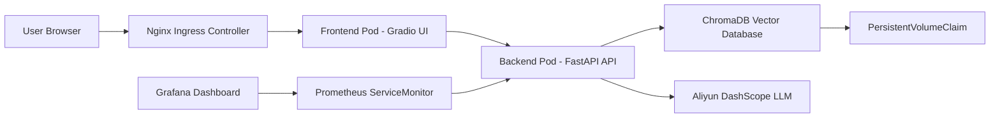
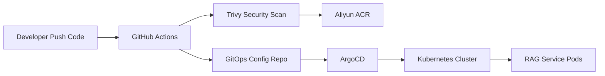

# RAG-Cloud-Native-Practice (Advanced Cloud-Native Architecture Practice for RAG LLMs)


## Overview

This project is a production-grade Cloud-Native engineering practice for Large Language Model (LLM) RAG (Retrieval-Augmented Generation) applications.

Starting from a simple local RAG script, the project systematically evolved through containerization, microservices decoupling, CI/CD automation, GitOps continuous delivery, Layer-7 traffic routing via Ingress, observability construction with Prometheus + Grafana, and state persistence using the ChromaDB vector database. It ultimately builds an enterprise-level AI application delivery pipeline based on Kubernetes.

> **Core Philosophy:** Bridging the engineering gap between an "AI Demo" and a "Production-grade AI Application." It focuses on solving real-world cloud-native challenges such as delivery, scalability, observability, state persistence, and automated operations.

---

## Architecture Topology

The project implements the separation of compute and storage, frontend-backend decoupling, Layer-7 traffic access, and full-stack observability within Kubernetes.



---

## Cloud Native Delivery Workflow

The project adopts a Dual-Repository GitOps architecture, completely decoupling the business source code from the Kubernetes infrastructure configurations.



The delivery pipeline workflow:
1. Developers push code to the business repository.
2. GitHub Actions automatically triggers the CI pipeline.
3. CI executes the Docker image build.
4. Trivy scans the image for vulnerabilities, implementing Shift-Left Security.
5. Upon passing the scan, the image is pushed to Aliyun ACR.
6. CI automatically updates the Image Tag in the GitOps configuration repository.
7. ArgoCD continuously monitors the GitOps repository for changes.
8. ArgoCD synchronizes the desired state to the Kubernetes cluster.
9. Kubernetes performs a rolling update to complete the deployment.

---

## Key Engineering Highlights

This project went through three major architectural evolutions, upgrading from a local AI demo to a fully cloud-native AI application.

### V1.0: Infrastructure as Code (IaC) & CI/CD Flywheel
* **Terraform Automation**: Replaced manual console operations with declarative cloud resource management via `main.tf`.
* **Containerization**: Packaged the local RAG application into a standard Docker image for environment consistency.
* **GitHub Actions CI/CD**: Automated build, scan, push, and configuration updates upon code push.
* **Shift-Left Security (Trivy)**: Blocks the pipeline if `CRITICAL` or `HIGH` vulnerabilities are detected before image push.
* **Dual-Repo GitOps Model**: Clear boundary between business code and Kubernetes Manifests.
* **ArgoCD Pull-based Delivery**: ArgoCD pulls configurations and syncs the cluster, preventing CI systems from holding highly privileged cluster credentials.

### V2.0: Microservices Split & Observability
* **Frontend-Backend Decoupling**: Split the monolithic `app.py` into frontend `ui.py` and backend `api.py`.
* **FastAPI Backend**: Focuses purely on RAG retrieval, vector querying, and LLM invocation.
* **Gradio Frontend**: Focuses strictly on user interaction and rendering.
* **Independent Scalability**: Frontend and backend can scale independently based on traffic or compute load.
* **Layer-7 Routing (Ingress)**: Uses Nginx Ingress Controller to manage external access, replacing basic NodePort exposure.
* **Prometheus + Grafana**: Instruments business metrics and uses `ServiceMonitor` to scrape QPS, latency, and error rates.
* **SRE Monitoring Loop**: Visualizes service health via Grafana Dashboards for capacity planning and troubleshooting.

### V3.0: State Extraction & Persistent Brain
* **Compute & Storage Separation**: Migrated local file system vector indices to a dedicated ChromaDB vector database.
* **StatefulSet Deployment**: Manages ChromaDB via Kubernetes `StatefulSet` to maintain stable service identity.
* **PersistentVolumeClaim (PVC)**: Mounts persistent storage to prevent knowledge base data loss during Pod restarts.
* **Instant Recovery**: Services can directly load existing vector data upon restart, significantly reducing redundant LLM Embedding costs.

---

## Tech Stack

### AI Application Layer
* Python 3.11, LlamaIndex, FastAPI, Gradio, DashScope API
### Containerization & Orchestration
* Docker, Docker Compose, Kubernetes, Kustomize, Nginx Ingress Controller
### Stateful Storage
* ChromaDB, StatefulSet, PersistentVolumeClaim
### CI/CD & GitOps
* GitHub Actions, Aliyun ACR, ArgoCD, Dual-Repo GitOps
### Observability & SRE
* Prometheus, Grafana, kube-prometheus-stack, ServiceMonitor
### Infrastructure as Code (IaC)
* Terraform, HCL

---

## Quick Start

This project supports both local containerized debugging and Kubernetes-native deployment. 
Ensure you have obtained an LLM API Key (e.g., Aliyun DashScope) before running.

### Method 1: Local Docker Compose (Recommended for Dev/Test)
Quickly spin up the decoupled microservices and ChromaDB locally without a K8s cluster.

1. Clone the application repository:
```bash
git clone https://github.com/AmazingYe-oss/edu-rag-bot.git
cd edu-rag-bot
```

2. Inject API credentials and start containers:
```bash
export DASHSCOPE_API_KEY="sk-your-api-key-here"
docker-compose up -d --build
```

3. Access the services:
* Frontend UI: `http://localhost:7860`
* Backend API Docs: `http://localhost:8000/docs`

### Method 2: Kubernetes Native Deployment (Recommended for Production)
Deploy the full cloud-native stack (including Ingress, ServiceMonitors, and PVCs) via Kustomize and GitOps.

1. Create a namespace and inject the Secret:
```bash
kubectl create namespace edu-rag-bot
kubectl create secret generic rag-secrets \
  --from-literal=DASHSCOPE_API_KEY="sk-your-api-key-here" \
  -n edu-rag-bot
```

2. Apply manifests using Kustomize:
```bash
kubectl apply -k https://github.com/AmazingYe-oss/edu-rag-bot-gitops.git/apps/edu-rag-bot
```

3. (Optional) GitOps Management: If ArgoCD is installed, apply the Application resource for auto-sync:
```bash
kubectl apply -f https://raw.githubusercontent.com/AmazingYe-oss/edu-rag-bot-gitops/main/edu-rag-bot-application.yaml
```

---

## Repository Structure

```text
├── .github/workflows/       # GitHub Actions CI automated pipeline
├── data/                    # Initial knowledge base documents
├── src/                     # Core RAG implementation
├── api.py                   # FastAPI backend microservice
├── ui.py                    # Gradio frontend UI
├── Dockerfile               # Unified Dockerfile for microservices
├── docker-compose.yml       # Local orchestration for dev/test
├── requirements.txt         # Core Python dependencies
└── main.tf                  # Terraform IaC definitions
```
> *Note: Declarative K8s configurations (Deployment, Ingress, StatefulSet, ServiceMonitor, etc.) are maintained in the separate GitOps state repository.*

---

## Project Highlights

* Evolved from a simple local python script to a Kubernetes-native AI application.
* Established an end-to-end automated deployment pipeline using GitHub Actions, Aliyun ACR, and ArgoCD.
* Implemented Shift-Left Security by integrating Trivy scanning into the CI phase.
* Adopted a Dual-Repo GitOps architecture to decouple source code from infrastructure configs.
* Managed Layer-7 traffic routing via Nginx Ingress.
* Constructed SRE observability using Prometheus and Grafana.
* Achieved vector data persistence and state extraction using ChromaDB, StatefulSet, and PVC.
* Covers multiple production-grade domains: AI Engineering, DevOps, SRE, Kubernetes, GitOps, and IaC.

---

## Use Cases

* Enterprise Internal Knowledge Base QA System
* Cloud-Native AI Application Engineering Practice
* Deploying RAG services on Kubernetes
* CI/CD and GitOps Delivery Demonstration for AI Applications
* Portfolio project for Cloud Computing, DevOps, SRE, or Solutions Architect roles

---

## Author

**Weiye Zhu (AmazingYe)**
* Class of 2027, Data Science and Big Data Technology
* AWS Certified Solutions Architect - Professional
* Aliyun ACP Certified (Large Language Models)
* Looking for internship opportunities in **Cloud Computing / Cloud Native / DevOps / SRE / AI Engineering**. Feel free to connect!
