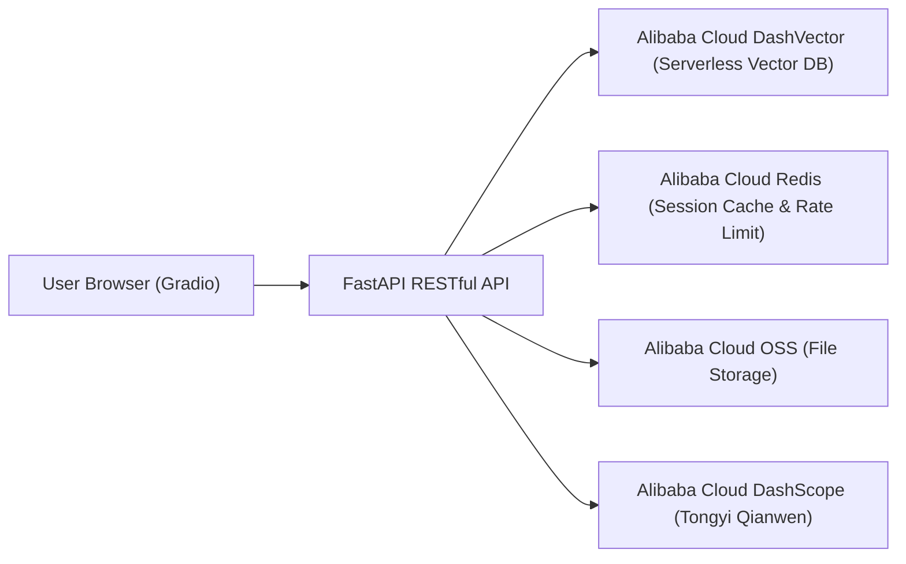
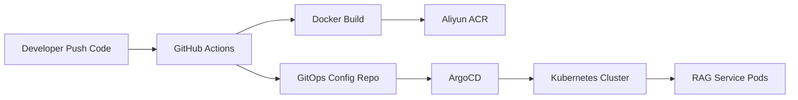

# Edu RAG Bot — AI Q&A System for Education Knowledge Base


## Project Overview

This project is an **RAG (Retrieval-Augmented Generation) AI Q&A system** designed for education scenarios, serving enterprise internal new employee onboarding and knowledge management.

The system builds its RAG retrieval pipeline based on **LlamaIndex + Tongyi Qianwen (DashScope)**, using **Alibaba Cloud DashVector** as a Serverless vector database, **Alibaba Cloud Redis** for session memory and API rate limiting, and **Alibaba Cloud OSS** for document cloud storage. The frontend adopts a **Gradio** interactive interface, while the backend uses a **FastAPI** microservice architecture with **SSE streaming typewriter output**, achieving cloud-native delivery through **Docker + Kubernetes + GitHub Actions + GitOps**.

> Core Positioning: Transform unstructured enterprise knowledge — such as policy documents, development standards, and training materials — into an AI knowledge base assistant capable of instant retrieval and intelligent Q&A.

---

## System Architecture



### Core Data Flow

1. User enters a question in the Gradio frontend
2. FastAPI RESTful backend receives the request and first queries **Redis cache** (returns directly on hit, zero LLM calling cost)
3. On cache miss, retrieves short-term conversation history for the session from **Redis** and concatenates context
4. Calls **DashVector** for vector semantic retrieval to obtain relevant knowledge snippets
5. Assembles retrieval context + conversation history into a Prompt, then calls the **DashScope Tongyi Qianwen** LLM
6. Streams back a typewriter effect via **SSE (Server-Sent Events)**
7. After completion, writes answer to Redis cache (TTL 1 hour) and saves session memory (TTL 24 hours)

### RESTful API Architecture

The system uses RESTful API design with modular routing:
- `src/routers/conversations.py` — Session management and message streaming
- `src/routers/search.py` — Pure retrieval endpoint
- `src/routers/documents.py` — Document upload and OSS storage
- `src/schemas/` — Pydantic request/response models

---

## Key Features

### RAG Retrieval Engine
- **LlamaIndex** orchestration framework: Document Loading → Vectorization → Index Building → Semantic Retrieval → Prompt Assembly → LLM Invocation
- **DashScope Embedding** (text-embedding-v3): Converts document chunks into 1536-dimensional vectors
- **DashScope LLM** (qwen-plus): Generates precise answers based on retrieval context
- Supports multiple document formats: TXT, Markdown, PDF, DOCX, Jupyter Notebook
- **RESTful API**: Modular routing design supporting session management, document upload, and pure retrieval endpoints

### SSE Streaming Output
- Character-by-character typewriter effect via `stream_chat`, enhancing user experience
- Frontend renders in real-time via SSE while displaying retrieval source context

### Session Memory Management
- **Redis List** stores short-term conversation history (independent per session, default retains last 3 rounds)
- Automatically concatenates conversation context for coherent multi-turn dialogue
- Session data auto-expires and cleans up after 24 hours

### Intelligent Caching & Rate Limiting
- **Redis Semantic Cache**: Exact-match caching for identical questions, zero LLM cost for repeat queries within 1 hour
- **API Rate Limit Protection**: Based on Redis + FastAPI-Limiter, max 5 requests per minute per endpoint

### File Upload (OSS)
- Supports uploading documents to Alibaba Cloud OSS for cloud storage of knowledge base documents
- Supports both server-side upload and pre-signed URL direct upload modes

### Observability
- Integrates **prometheus-fastapi-instrumentator**, automatically exposing `/metrics` endpoint
- Supports collection of API metrics including QPS, request latency, error rate

---

## Tech Stack

| Layer | Technology |
|-------|-----------|
| AI Framework | LlamaIndex, DashScope API (Tongyi Qianwen + text-embedding-v3) |
| Backend | FastAPI, Uvicorn, SSE Streaming |
| Frontend | Gradio (Soft theme, adaptive dark/light mode) |
| Vector Database | Alibaba Cloud DashVector (Serverless) |
| Cache & Rate Limit | Alibaba Cloud Redis, FastAPI-Limiter |
| Object Storage | Alibaba Cloud OSS (oss2 SDK) |
| Containerization | Docker (multi-stage build), Docker Compose |
| Orchestration & Deployment | Kubernetes, Terraform (IaC), Nginx Ingress |
| CI/CD | GitHub Actions → Alibaba Cloud ACR → Dual-repo GitOps |
| Observability | Prometheus (fastapi-instrumentator) |

---

## Quick Start

### Prerequisites

- Python 3.10+
- Alibaba Cloud DashScope API Key ([Apply Here](https://dashscope.console.aliyun.com/))
- Alibaba Cloud DashVector Instance ([Activate Here](https://dashvector.console.aliyun.com/))
- Alibaba Cloud Redis Instance (optional, can use local Redis instead)
- Alibaba Cloud OSS Bucket (optional, file upload feature unavailable if not configured)

### Method 1: Local Run (Dev/Debug)

1. Clone the repository:
```bash
git clone https://github.com/AmazingYe-oss/edu-rag-bot.git
cd edu-rag-bot
```

2. Install dependencies:
```bash
pip install -r requirements.txt
```

3. Configure environment variables (copy template and fill in actual credentials):
```bash
cp .env.example .env
# Edit .env file and fill in the following required fields:
# - DASHSCOPE_API_KEY      (Required, LLM invocation)
# - DASHVECTOR_API_KEY     (Required, vector database)
# - DASHVECTOR_ENDPOINT    (Required, vector database)
# - REDIS_HOST / PASSWORD  (Recommended, session cache)
# - OSS_ACCESS_KEY_ID etc. (Optional, file upload)
```

4. Start backend and frontend:
```bash
# Terminal 1: Start backend API
python api.py

# Terminal 2: Start frontend UI
python ui.py
```

5. Access:
- Frontend UI: `http://localhost:7860`
- Backend API Docs: `http://localhost:8000/docs`

### Method 2: Docker Compose One-Click Start

```bash
# Ensure .env file is properly configured
docker-compose up -d --build
```

Access addresses are the same as above:
- Frontend: `http://localhost:7860`
- Backend: `http://localhost:8000/docs`

### Method 3: Kubernetes Cloud-Native Deployment

#### Step 0: Cluster Infrastructure Setup

> The following components must be installed on a brand new cluster:

1. **Install NGINX Ingress Controller**:
```bash
kubectl apply -f https://raw.githubusercontent.com/kubernetes/ingress-nginx/controller-v1.10.1/deploy/static/provider/cloud/deploy.yaml
```

2. **Install Prometheus Operator** (for ServiceMonitor monitoring CRD):
```bash
helm repo add prometheus-community https://prometheus-community.github.io/helm-charts
helm repo update
helm install prometheus-operator prometheus-community/kube-prometheus-stack -n edu-rag-bot --create-namespace
```

#### Step 1: Inject Secrets

```bash
kubectl create namespace edu-rag-bot
kubectl create secret generic edu-rag-bot-secret \
  --namespace edu-rag-bot \
  --from-literal=DASHSCOPE_API_KEY="your-dashscope-key" \
  --from-literal=OSS_ACCESS_KEY_ID="your-oss-sub-account-ak" \
  --from-literal=OSS_ACCESS_KEY_SECRET="your-oss-sub-account-sk" \
  --from-literal=OSS_ENDPOINT="oss-cn-shanghai.aliyuncs.com" \
  --from-literal=OSS_BUCKET_NAME="your-real-bucket-name" \
  --from-literal=REDIS_HOST="your-alibaba-cloud-redis-address" \
  --from-literal=REDIS_PASSWORD="your-redis-password" \
  --from-literal=DASHVECTOR_API_KEY="your-dashvector-key" \
  --from-literal=DASHVECTOR_ENDPOINT="your-dashvector-endpoint"

```

> The Secret must be named `edu-rag-bot-secret`, otherwise the backend cannot read the configuration.

#### Step 2: Deploy Application

**Option A: Kustomize Deployment**
```bash
kubectl apply -k https://github.com/AmazingYe-oss/edu-rag-bot-gitops.git/apps/edu-rag-bot
```

**Option B: ArgoCD GitOps Management**
```bash
kubectl apply -f https://raw.githubusercontent.com/AmazingYe-oss/edu-rag-bot-gitops/main/edu-rag-bot-application.yaml
```

#### Step 3: Verify and Access

```bash
kubectl get pods -n edu-rag-bot -w
```

**Access via Ingress Domain** (Recommended):
1. Add to hosts file: `127.0.0.1 rag.weiye.local`
2. Open browser: http://rag.weiye.local

**Access via Port Forwarding** (Fallback):
```bash
kubectl port-forward deployment/rag-frontend 7860:7860 -n edu-rag-bot
```
Open browser: http://localhost:7860

---

## API Endpoint Documentation

After starting the backend, visit `http://localhost:8000/docs` for the complete Swagger UI documentation.

### Conversations

| Method | Endpoint | Description |
|--------|----------|-------------|
| POST | `/api/v1/conversations` | Create a new session, returns conversation_id |
| POST | `/api/v1/conversations/{id}/messages` | Send a message and get SSE streaming response |
| GET | `/api/v1/conversations/{id}/messages` | Get session message history |

### Documents

| Method | Endpoint | Description |
|--------|----------|-------------|
| POST | `/api/v1/documents` | Upload document to OSS and vectorize into database |
| POST | `/api/v1/documents/presigned-url` | Get OSS presigned upload URL |

### Search

| Method | Endpoint | Description |
|--------|----------|-------------|
| POST | `/api/v1/search` | Pure vector search, returns Top-K relevant snippets |

### Health

| Method | Endpoint | Description |
|--------|----------|-------------|
| GET | `/api/v1/health` | Service health check |
| GET | `/metrics` | Prometheus monitoring metrics |

---

## Environment Variables

| Variable | Required | Description |
|----------|----------|-------------|
| `DASHSCOPE_API_KEY` | ✅ | Alibaba Cloud Tongyi Qianwen LLM API Key |
| `DASHVECTOR_API_KEY` | ✅ | Alibaba Cloud DashVector Vector Database API Key |
| `DASHVECTOR_ENDPOINT` | ✅ | Alibaba Cloud DashVector Service Endpoint |
| `DASHSCOPE_LLM_MODEL` | ❌ | LLM model name, default `qwen-plus` |
| `DASHSCOPE_EMBED_MODEL` | ❌ | Embedding model name, default `text-embedding-v3` |
| `REDIS_HOST` | Recommended | Redis address, default `127.0.0.1` |
| `REDIS_PORT` | Recommended | Redis port, default `6379` |
| `REDIS_PASSWORD` | Recommended | Redis password |
| `OSS_ACCESS_KEY_ID` | Optional | Alibaba Cloud OSS AccessKey ID |
| `OSS_ACCESS_KEY_SECRET` | Optional | Alibaba Cloud OSS AccessKey Secret |
| `OSS_ENDPOINT` | Optional | Alibaba Cloud OSS Endpoint |
| `OSS_BUCKET_NAME` | Optional | Alibaba Cloud OSS Bucket name |
| `SIMILARITY_TOP_K` | Optional | Number of Top-K retrieval results, default `3` |
| `DATA_DIR` | Optional | Local knowledge base document directory, default `data` |

---

## Project Directory Structure

```text
├── .github/workflows/       # GitHub Actions CI/CD pipeline
├── src/                     # Core business logic
│   ├── routers/             # FastAPI route modules (RESTful API)
│   │   ├── conversations.py # Session management and message streaming
│   │   ├── search.py        # Pure retrieval endpoint
│   │   └── documents.py     # Document upload and OSS storage
│   ├── schemas/             # Pydantic request/response models
│   │   ├── conversation.py  # Conversation schemas
│   │   ├── search.py        # Search schemas
│   │   ├── document.py      # Document schemas
│   │   └── common.py        # Common response models
│   ├── config.py            # Environment variable configuration loading
│   ├── rag_service.py       # RAG retrieval engine (DashVector + DashScope)
│   ├── memory_manager.py    # Redis session memory management
│   ├── document_loader.py   # Multi-format document loader (PDF/DOCX/TXT/MD/IPYNB)
│   ├── dependencies.py      # Dependency injection and lifecycle management
│   └── prompts.py           # System Prompt templates
├── api.py                   # FastAPI entry point (RESTful + SSE streaming + rate limit + OSS upload)
├── ui.py                    # Gradio frontend interactive interface
├── Dockerfile               # Multi-stage build image file
├── docker-compose.yml       # Local container orchestration (api + ui services)
├── requirements.txt         # Python dependency manifest
├── main.tf                  # Terraform IaC infrastructure declaration
├── .env.example             # Environment variable configuration template
└── .env                     # Actual environment variables (not committed to Git)
```

> Kubernetes GitOps configurations (Deployment, Ingress, StatefulSet, ServiceMonitor, etc.) are maintained in the separate repository [edu-rag-bot-gitops](https://github.com/AmazingYe-oss/edu-rag-bot-gitops).

---

## Cloud Native Delivery Workflow

The project adopts a Dual-Repository GitOps architecture, completely decoupling the business source code from the Kubernetes configuration repository.



The delivery pipeline workflow:

1. Developers push code to the business repository (main branch).
2. GitHub Actions automatically triggers the CI pipeline.
3. CI executes Docker image build (multi-stage build optimization).
4. Image is pushed to Alibaba Cloud ACR (tagged with both latest and commit SHA).
5. CI automatically updates the Image Tag in the GitOps configuration repository.
6. ArgoCD continuously monitors the GitOps repository for changes.
7. ArgoCD synchronizes the desired state to the Kubernetes cluster.
8. Kubernetes performs a rolling update to complete the deployment.

---

## FAQ

**Q: Backend startup reports `DASHVECTOR_API_KEY` not configured?**
A: Ensure `.env` file or K8s Secret correctly configures `DASHVECTOR_API_KEY` and `DASHVECTOR_ENDPOINT`.

**Q: Redis connection fails?**
A: Check whether `REDIS_HOST`, `REDIS_PORT`, `REDIS_PASSWORD` are correct. You can start a local Redis instance for development.

**Q: Backend Pod status is `CreateContainerConfigError`?**
A: Usually the Secret name is not `edu-rag-bot-secret` or required environment variables are missing. Use `kubectl describe pod` to view Events.

**Q: Deployment prompts `no matches for kind "ServiceMonitor"`?**
A: Prometheus CRD resources are missing in the cluster. Execute Step 0 to install kube-prometheus-stack.

**Q: OSS upload returns 503?**
A: OSS environment variables are not configured, or the AccessKey has insufficient permissions.

---

## Use Cases

- Enterprise internal knowledge base intelligent Q&A
- New employee onboarding self-service Q&A
- Educational content development standards lookup
- Cloud-native AI application engineering practice
- AI application CI/CD and GitOps delivery demonstration

---

## Author

**Weiye Zhu (AmazingYe)**
- Class of 2027, Data Science and Big Data Technology
- AWS Certified Solutions Architect - Professional
- Alibaba Cloud Large Model ACP Certified
- Looking for internship opportunities in **Cloud Computing / Cloud Native / DevOps / SRE / AI Engineering**. Feel free to connect!
