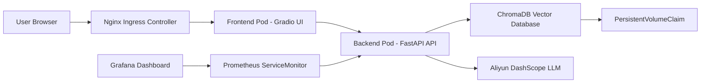
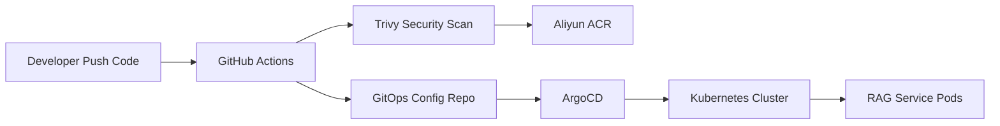

# RAG-Cloud-Native-Practice

English Version | [中文版](./README.md)


## Overview

This project is a production-oriented cloud-native engineering practice for a Large Language Model based RAG application.

Starting from a local Retrieval-Augmented Generation script, the project gradually evolves into an enterprise-grade AI application delivery system on Kubernetes. It covers containerization, microservice decomposition, CI/CD automation, GitOps-based continuous delivery, Ingress-based Layer 7 traffic management, Prometheus and Grafana observability, and persistent vector database storage with ChromaDB.

> Core design principle: bridge the engineering gap between an AI demo and a production-ready AI application by focusing on delivery automation, scalability, observability, persistence, and cloud-native operations.

---

## Architecture Topology

The system implements compute-storage separation, frontend-backend decoupling, Layer 7 traffic routing, and full-stack observability on Kubernetes.



---

## Cloud Native Delivery Workflow

The project adopts a dual-repository GitOps architecture, separating the application source code repository from the Kubernetes manifest repository.



Delivery workflow:

1. The developer pushes code to the application repository.
2. GitHub Actions automatically triggers the CI pipeline.
3. The CI pipeline builds the Docker image.
4. Trivy scans the image for security vulnerabilities.
5. If the scan passes, the image is pushed to Aliyun ACR.
6. The CI pipeline updates the image tag in the GitOps configuration repository.
7. ArgoCD watches the GitOps repository for desired state changes.
8. ArgoCD synchronizes the desired state to the Kubernetes cluster.
9. Kubernetes performs a rolling update and brings the RAG service online.

---

## Key Engineering Highlights

This project went through three major architectural evolutions, upgrading from a local AI demo to a cloud-native AI application.

### V1.0: Infrastructure as Code and CI/CD Flywheel

- **Infrastructure as Code with Terraform**: Uses `main.tf` to declaratively manage cloud resources instead of relying on manual console operations.
- **Docker-based Containerization**: Packages the RAG application into a standard container image for consistent and portable delivery.
- **GitHub Actions CI Pipeline**: Automatically builds, scans, pushes, and updates deployment configuration after each code push.
- **Trivy Security Shift-left Scanning**: Scans container images before pushing them to the registry and blocks `CRITICAL` and `HIGH` severity vulnerabilities.
- **Dual-repository GitOps Model**: Separates application source code from Kubernetes manifests for better responsibility boundaries.
- **ArgoCD Pull-based Delivery**: ArgoCD pulls the desired state from the GitOps repository and syncs it to the cluster, avoiding direct high-privilege cluster access from the CI system.

### V2.0: Microservice Decomposition and Observability

- **Frontend-backend Decoupling**: Splits the original monolithic `app.py` into `ui.py` for the frontend and `api.py` for the backend.
- **FastAPI Backend Service**: Handles RAG retrieval, vector search, and LLM invocation.
- **Gradio Frontend Service**: Provides the user-facing interface for knowledge-base Q&A.
- **Independent Horizontal Scaling**: Frontend and backend services can be scaled independently according to traffic and workload characteristics.
- **Nginx Ingress Layer 7 Routing**: Uses Ingress as the unified external traffic entry point instead of exposing services via simple NodePort.
- **Prometheus and Grafana Observability Stack**: Collects business metrics through instrumentation and ServiceMonitor.
- **SRE Monitoring Loop**: Visualizes QPS, latency, and error rate through Grafana dashboards to support capacity planning and troubleshooting.

### V3.0: Stateful Persistence and Vector Database

- **Compute-storage Separation**: Moves vector indexes out of the local filesystem and into ChromaDB.
- **ChromaDB Vector Database**: Stores embedding data for semantic retrieval in the RAG pipeline.
- **StatefulSet for Stateful Workloads**: Runs ChromaDB as a Kubernetes StatefulSet to provide stable identity and storage binding.
- **PersistentVolumeClaim Storage**: Uses PVC-based persistent storage to prevent knowledge-base data loss after Pod recreation.
- **Fast Knowledge Base Recovery**: Enables the service to reuse existing vector data after restart, reducing repeated embedding cost.

---

## Tech Stack

### AI Application Layer

- Python 3.11
- LlamaIndex
- FastAPI
- Gradio
- DashScope API

### Containerization and Orchestration

- Docker
- Docker Compose
- Kubernetes
- Kustomize
- Nginx Ingress Controller

### Stateful Storage

- ChromaDB
- StatefulSet
- PersistentVolumeClaim

### CI/CD and GitOps

- GitHub Actions
- Aliyun ACR
- ArgoCD
- Dual-repository GitOps model

### Observability and SRE

- Prometheus
- Grafana
- kube-prometheus-stack
- ServiceMonitor
- prometheus-fastapi-instrumentator

### Infrastructure as Code

- Terraform
- HCL

---

## Repository Structure

```text
├── .github/workflows/       # GitHub Actions CI pipeline
├── data/                    # Initial documents for the RAG knowledge base
├── src/                     # Core RAG logic
├── api.py                   # FastAPI backend microservice
├── ui.py                    # Gradio frontend service
├── Dockerfile               # Unified container image build file
├── requirements.txt         # Python dependencies
└── main.tf                  # Terraform IaC configuration
```

> Note: Kubernetes declarative configurations such as Deployment, Service, Ingress, StatefulSet, ServiceMonitor, and Kustomization are maintained in a separate GitOps configuration repository.

---

## Project Highlights

- Evolves a local RAG script into a cloud-native AI application running on Kubernetes.
- Builds an end-to-end automated delivery workflow with GitHub Actions, Aliyun ACR, and ArgoCD.
- Introduces Trivy security scanning to shift container image security checks left into the CI pipeline.
- Adopts a dual-repository GitOps model to decouple application code and infrastructure configuration.
- Uses Nginx Ingress for Layer 7 traffic entry management.
- Builds basic SRE observability with Prometheus and Grafana.
- Implements persistent vector storage with ChromaDB, StatefulSet, and PVC.
- Covers multiple production-level engineering domains, including AI engineering, DevOps, SRE, Kubernetes, GitOps, and Infrastructure as Code.

---

## Use Cases

This project can be used for:

- Enterprise internal knowledge-base Q&A systems
- Cloud-native AI application engineering practice
- RAG service deployment on Kubernetes
- AI application CI/CD and GitOps delivery demonstration
- Portfolio project for cloud computing, DevOps, SRE, and solution architect roles

---

## Author

**Weiye Zhu (AmazingYe)**

- B.S. in Data Science and Big Data Technology, Class of 2027
- AWS Certified Solutions Architect - Professional
- Alibaba Cloud Model Studio ACP Certified
- Seeking internship opportunities in Cloud Computing, Cloud Native, DevOps, SRE, and AI Engineering
